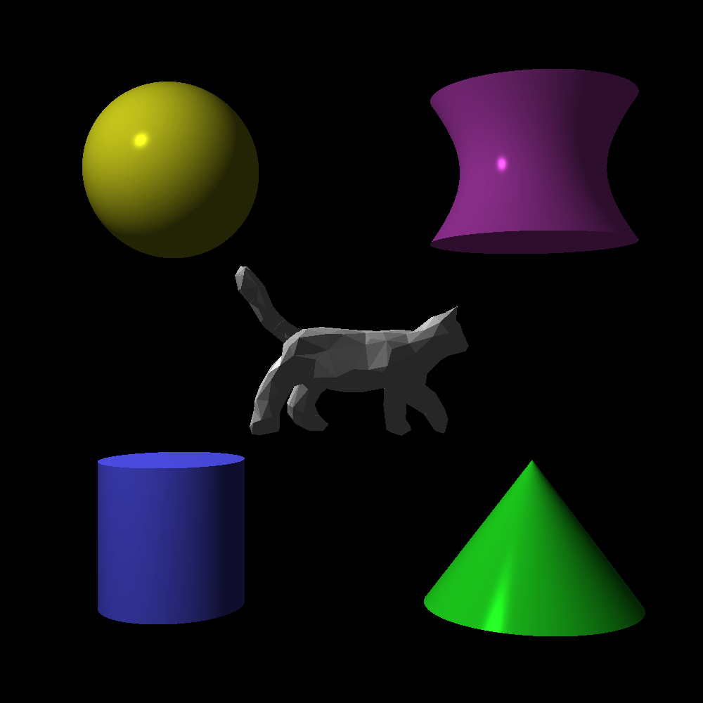
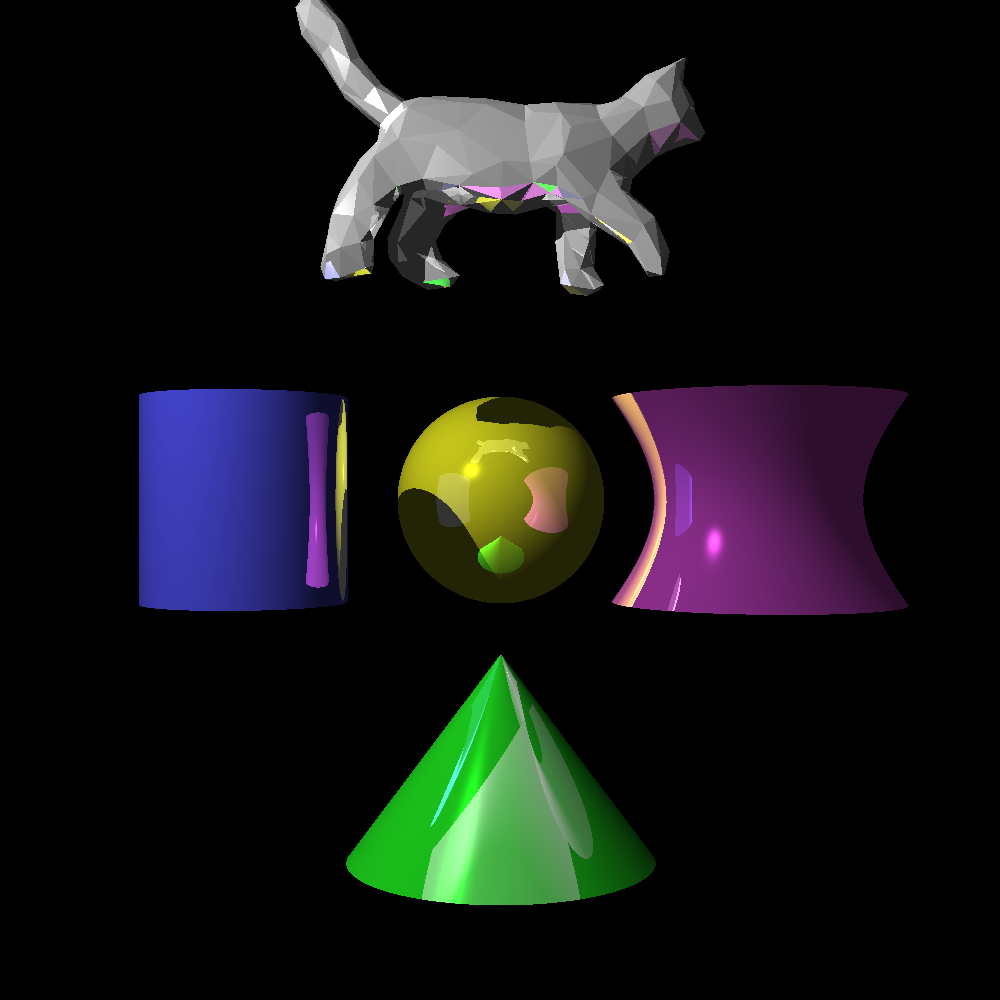
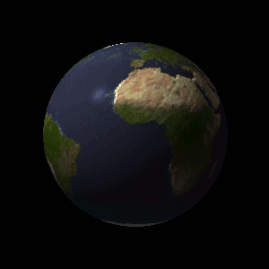
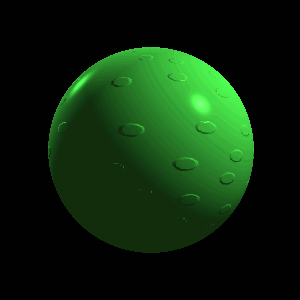
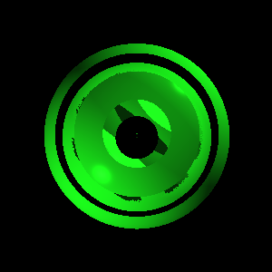
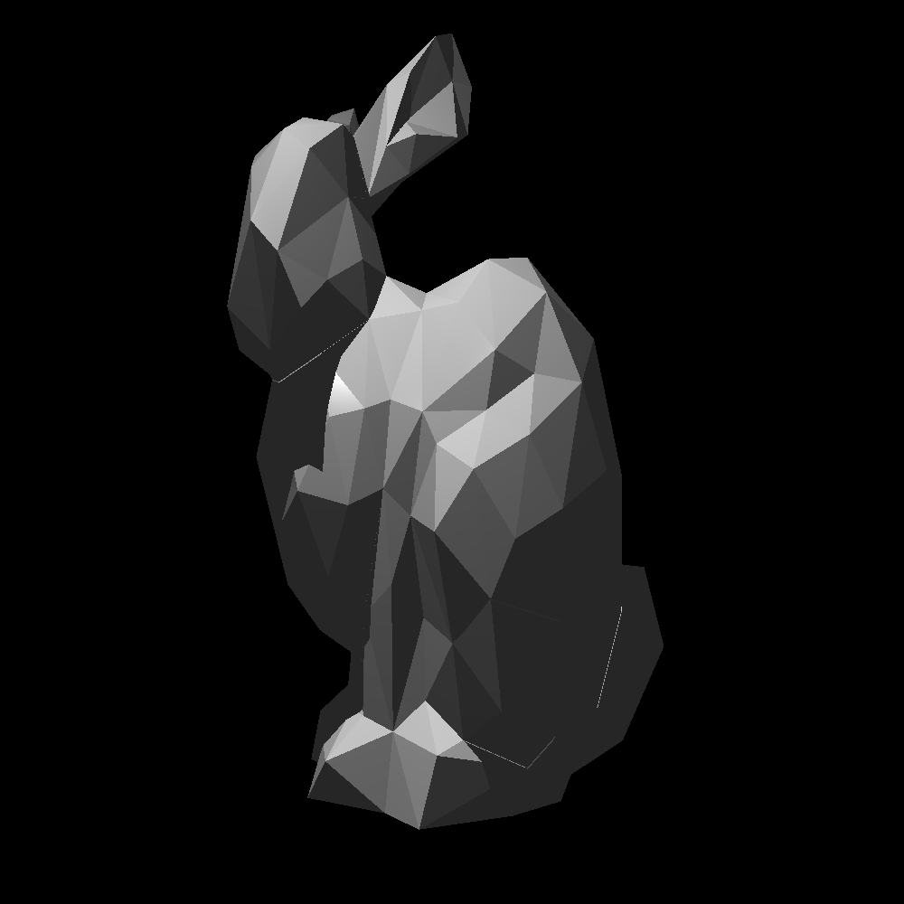
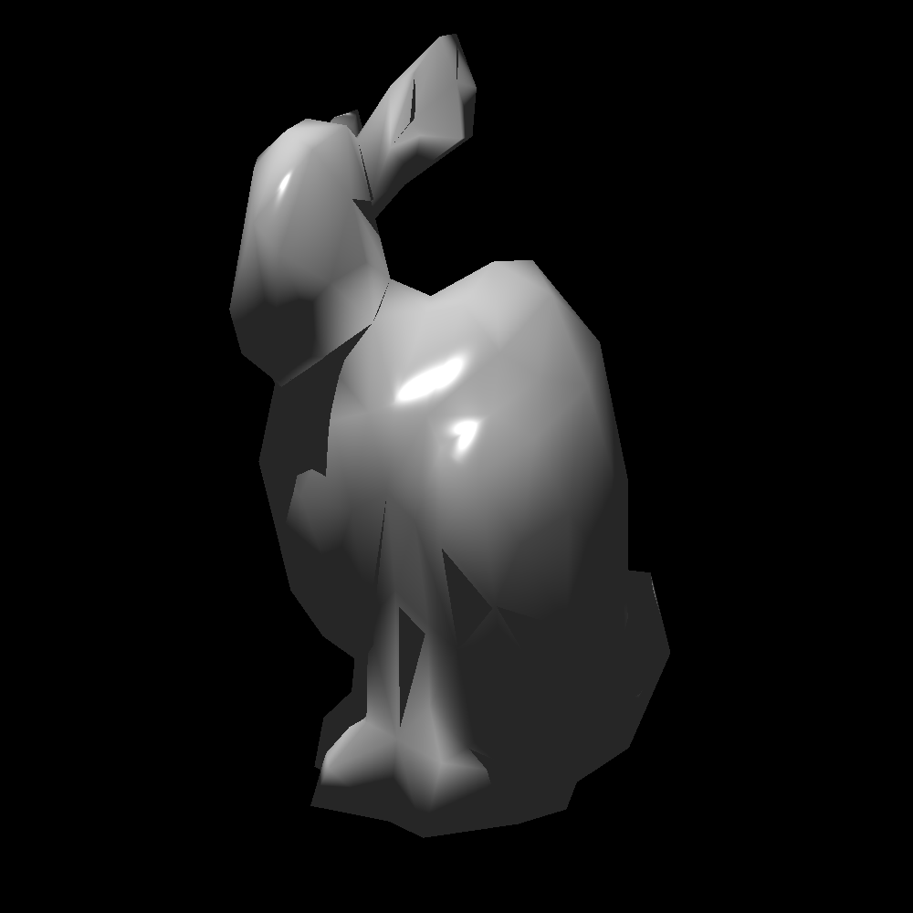
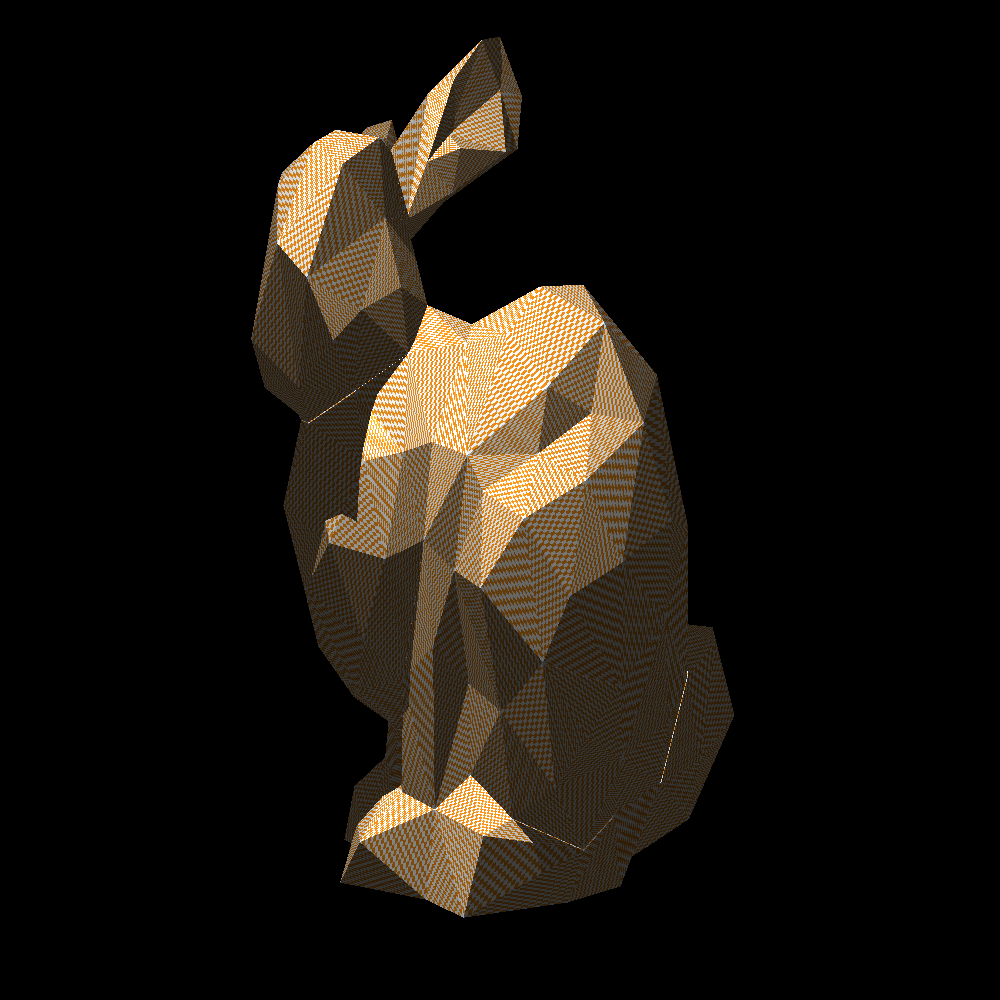
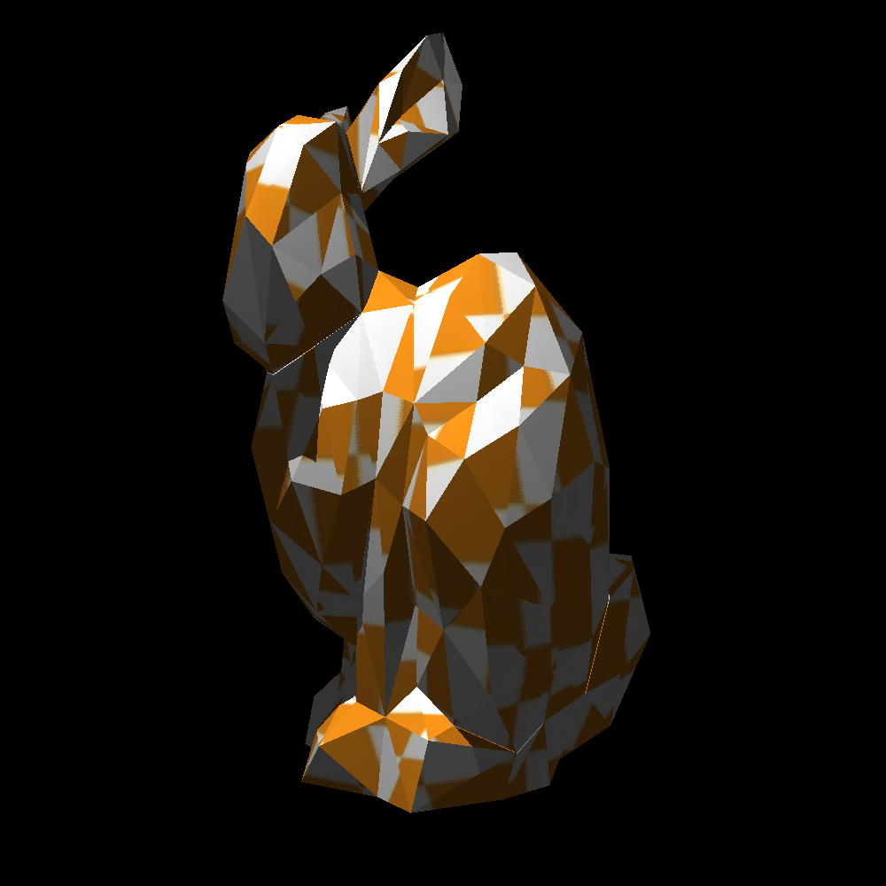
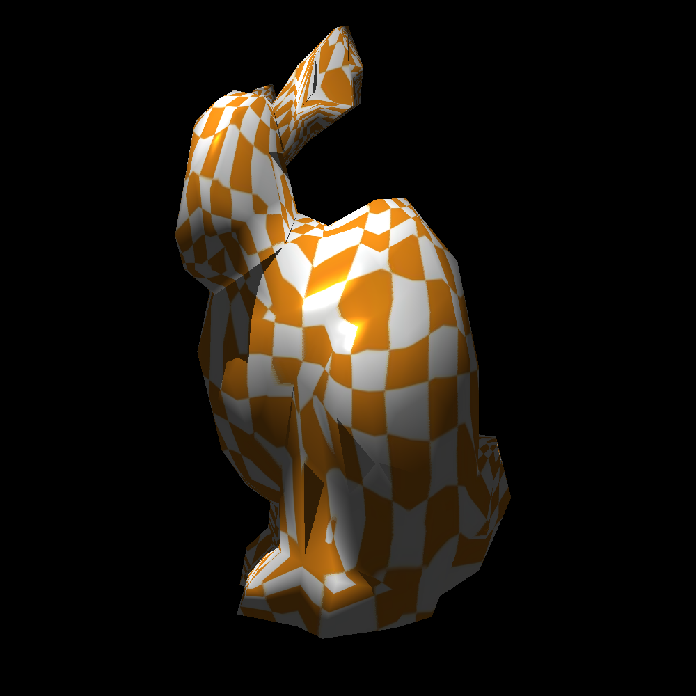

# Ray Tracer
This project, initially created as part of my college coursework, is a raytracer capable of rendering scenes containing lights, shapes, and meshes with a variety of features. 

## Overview
Each image rendered by the raytracer is contained in a **Scene**, the details of which are provided in a .pov file. Each Scene contains a **Camera**, one or more **Lights**, and any number of **Shapes**. When the Scene is rendered, points of color are drawn onto a **Canvas**, which is exported into a .ppm file. To calculate each point of color on the Canvas, the Camera projects a ray into the Scene, and calculates whether or not that ray intersects with any of the Shapes in the Scene. If it does, new rays are projected from the intersection point to calculate if that point is in light or shadow, and to calculate the colors of any reflections that might be present on the surface of the shape. 

In addition to the static images created by the render() method, there are two additional rendering methods for creating animations. The animate() method creates an animation by moving the Camera in a circle around the center of the Scene and taking several renders. The animate_spherical() method creates an animation by rotating the camera in a spiral around the center of the scene.

## Shapes
There are five types of shapes that this raytracer implements: **Spheres**, **Cylinders**, **Cones**, **Hyperboloids**, and custom **Meshes** to create complex three dimensional models. Each of these shapes inherits from a Shape parent object, which defines characteristics common among all inherited shapes such as radius, material properties, and color.

All shapes have a set of material properties that determine appearance characteristics like diffusion and phong size. Additionally, a maximum number of reflections can be set which determines how many times a ray will reflect off the surface it hits.

One reflection            |  Two reflections
:-------------------------:|:-------------------------:
|

The Sphere shape also implements the ability to map image, bump, and mask .ppm maps onto the surface of the sphere. An image map changes the appearance of the sphere's surface, and a bump map adjusts the shadow and reflection rays from the surface of the sphere, giving the appearance of texture and depth. Finally, the mask map determines what parts of the sphere are visible or transparent.

Sphere with image map      |Sphere with bump map       |  Sphere with masking
:-------------------------:|:-------------------------:|:-------------------------:
||

## Meshes
Meshes are comprised of multiple **Triangle** shapes placed edge-to-edge to create a three-dimensional figure. Meshes have the unique option of smoothing, which interpolates the normal vector of each triangle based on those adjacent to it, giving the mesh a smoother appearance.

Flat mesh                  |Mesh with smoothing     
:-------------------------:|:-------------------------:
|

Additionally, Meshes can also map .ppm images onto their surface. This can either be done *directly*, in which the image is mapped directly onto each triangle of the mesh, or *spherically*, in which the image is mapped onto a sphere and transposed onto the mesh as a whole. The difference is particularly apparent in this example using a white and orange grid.
Flat mesh with direct map  |Smooth mesh with direct map   
:-------------------------:|:-------------------------:
|

Flat mesh with spherical map |Smooth mesh with spherical map       
:---------------------------:|:-------------------------:
|
